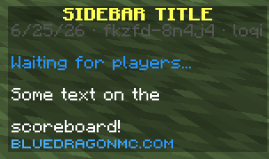

`SidebarModule` shows a per-player sidebar to all players in the game.

## Bindings

A **binding** is a function that returns a list of text components to display on the sidebar. Games can only have one binding at a time. Add one with the `bind` method:

```kotlin
sidebarModule.bind { player ->
    getStatusSection() + listOf(
        Component.text("Some text on the"),
        getSpacer(),
        Component.text("scoreboard!"),
    )
}
```

That binding looks like this:


`SidebarModule` exposes a number of helper methods inside the binding block, including:

- `getSpacer()`: always returns a component that can be used as an empty line. `Component.empty()` won't work more than once because every line must be unique.
- `getStatusSection()`: returns a component showing the pre-game state (server starting, waiting, starting), with spacers before and after. If the game is ingame or ending, the function returns a single spacer.

The `bind` method returns a reference to the new scoreboard binding. You can use `binding.update()` to refresh the sidebar at any time. The sidebar is automatically updated when the game state changes.

The footer text is derived from the `global.server.domain.stylized` translation key.

## Usage

Import the module:

```kotlin
import com.bluedragonmc.server.module.gameplay.SidebarModule
```

Use the module in your game's `initialize` function.

```kotlin
// title is shown at the top of the sidebar
use(SidebarModule(title = "Sidebar Title")) { sidebarModule ->
    // here is a great place to add your binding with sidebarModule.bind!
}
```
